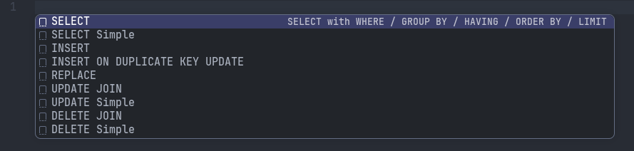

# MariaDB & MySQL Database Client for VS Code

Fast **MariaDB & MySQL database client** for **Visual Studio Code** with intelligent SQL autocomplete, schema browsing, query execution, inline data editing and SQL formatting.

---

## Features

- ⚡ Fast and lightweight DB client
- 🧠 SQL IntelliSense, autocomplete and snippets (`Ctrl+Space`)
- 📂 Schema, table and column suggestions (`Ctrl+Space`)
- 🔧 MariaDB & MySQL function suggestions (`Ctrl+Space`)
- ▶️ Execute current query (`Ctrl+Enter`)
- ▶️ Execute entire SQL file (`Alt+X`)
- ✏️ Inline table data editing
- 📊 Bulk edit values for the selected column(s)
- 📝 Generate INSERT, UPDATE, and DELETE statements for selected row(s)
- 🎨 SQL formatter (`Ctrl+Shift+F`)
- 📋 Recent SQL files (`F3`)
- 🎨 Connection color indicators
- 🛑 Kill long-running queries
- 🔒 Production/read-only connection safeguards (see [Production safety](#-production-safety) below)

---

## ⚙️ How to Install & Configure

The extension securely reads your database connections using standard MariaDB option files (`.cnf`).

### Step 1: Create configuration directory
In your user home directory, create a folder named `.db_configs`:
- **Linux/macOS:** `~/.db_configs/`
- **Windows:** `C:\Users\<YourUsername>\.db_configs\`

If this folder doesn't exist yet, you don't have to create it by hand: opening a `.sql` file will offer to create a default localhost connection for you (**DB client: Create Default Connection (localhost)**). This creates the folder (if needed) and a `localhost.cnf` file (`chmod 600`) pre-filled with typical WAMP-style defaults (`root`, no password, `127.0.0.1:3306`) — it's opened straight away so you can adjust `database` and anything that doesn't match your setup. Running the command again never overwrites an existing `.cnf` file.

Since `.cnf` files contain plaintext credentials, restrict access to your user only:

```bash
chmod 600 ~/.db_configs/*.cnf
```

### Step 2: Add your database settings
Place one or more connection configuration files in the `.db_configs` directory. You can create multiple files for different servers. Here are examples of how to configure them:

#### Example 1: Local Socket Connection (`local.cnf`)
```ini
[client]
socket = /run/mysqld/mysqld.sock
user = root
password = root
database = 
skip-ssl = true
reconnect = false
compress = false
```

> `skip-ssl` disables TLS. That's fine here because a Unix socket connection never leaves the machine, but it should **not** be used for any connection that goes over the network — see Example 3 below.

#### Example 2: Reusing/Inheriting Settings (`local-xxx.cnf`)
```ini
!include ~/.db_configs/local.cnf

[client]
database = xxx
```

#### Example 3: External Remote Server (`external.cnf`)
```ini
[client]
host = <host>
user = <user>
password = <password>
database = <name_of_database>
ssl-ca = /path/to/ca-cert.pem
reconnect = true
compress = true

[mysqld]
tcp_keepalive_time = 60
```

> ⚠️ **Always use TLS for remote connections.** Unlike Example 1, this connection goes over the network, so without `ssl-ca` (or with `skip-ssl = true`) your credentials and query results would be sent unencrypted. Only set `skip-ssl = true` on a remote host for a throwaway dev/test server, never for anything you care about.

> 💡 Need more details on configuration? Check the official [MariaDB Option Files Documentation](https://mariadb.com/docs/server/server-management/install-and-upgrade-mariadb/configuring-mariadb/configuring-mariadb-with-option-files).

---

## 🔒 Production safety

Two extra, extension-specific options can be added to any `.cnf` file, in their own `[db-client]` section:

```ini
[client]
host = ...
user = ...
password = ...
database = ...

[db-client]
production = true   # shows a red "PRODUCTION" warning banner in the results panel
readonly   = true    # blocks INSERT/UPDATE/DELETE/DDL on this connection entirely
```

> These must go in `[db-client]`, **not** `[client]`. `[client]` is also read by the real `mysql`/`mariadb` command-line tools, which reject unknown variables (`unknown variable 'production=true'`) — unknown *sections* like `[db-client]` are simply ignored by them, so keeping these two options there means the same `.cnf` file still works fine as a `--defaults-file` for the real CLI tools.

There are also two related settings, available under **Settings → Extensions → DB Client**:

- `db-client.blockUnsafeUpdateDelete` (default: **on**) — blocks `UPDATE`/`DELETE` statements that don't have a `WHERE` clause, since those affect the whole table.
- `db-client.requireConnectionNameConfirmation` (default: off) — before a bulk delete or bulk column edit from the results grid, requires typing the connection name to confirm. Destructive confirmations always show the target host and database.

---

## 🚀 How to Use

#### Run SQL

1. Open or create any file with a `.sql` extension.
2. Type your database query.
3. Press **`Ctrl + Enter`** to execute the current SQL query, or **`Alt + X`** to run the whole file.

> Running the whole file executes every statement in it (the results grid shows the last `SELECT`'s results). Note that DDL statements (`CREATE`/`ALTER`/`DROP`/`TRUNCATE`/`RENAME`) auto-commit in MySQL/MariaDB, so wrapping a script in a transaction can't roll those back if a later statement fails.

#### Snippets

1. Place the cursor at the beginning of a new line.
2. Press `Ctrl + Space`.
3. Select the SQL snippet you want to insert.



#### Change DB connection and DB color


#### Setup & connection commands

| Command | Description |
|---|---|
| DB client: Create Default Connection (localhost) | First-run setup: creates `.db_configs` (if needed) + a default `localhost.cnf` (skipped if any `.cnf` already exists) |
| DB client: Reload Connection Files | Re-scan `.db_configs` for `.cnf` files after adding/editing one |
| DB client: Test Connection | Verify a connection can be established |

---

## 🐧 OS Support

#### Supported Platforms
✅ Linux

✅ Windows

#### Linux Notes
To see colors correctly when assigning a color to a database connection, install the Noto Color Emoji font.
* **Debian / Ubuntu:**
  ```bash
  sudo apt install fonts-noto-color-emoji
  ```

---

## 📄 License

[GPL-2.0](LICENSE)

## ☕ Support the Project

[](https://ko-fi.com/w77w77)
