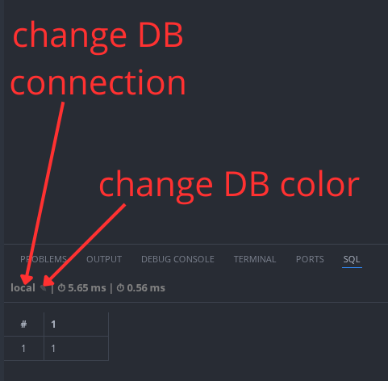

# DB Client W77

## Description
It is an extension for VS Code that works like MariaDB client.

## Features
- High performance.
- Schema, table, and field name suggestions when writing SQL.
- Data editing capabilities.
- List of recently used SQL files.
- Ability to select a color for a specific DB connection.
- "Kill query" for break long query.
- Code formatting and more.

## How to install
1. In your home directory, create a directory called ".db_configs."
2. Place the database settings file in it, e.g.:

```ini
# Example "local.cnf"
[client]
socket = /run/mysqld/mysqld.sock
user = root
password = root
database =
skip-ssl = true
reconnect = false
compress = false
```
```ini
# Example "local-xxx.cnf"
!include ~/.db_configs/local.cnf

[client]
database = xxx
```
```ini
# Example "external.cnf"
[client]
host = <host>
user = <user>
password = <password>
database = <name of database>
skip-ssl = true
reconnect = true
compress = true

[mysqld]
tcp_keepalive_time = 60
```
More information [here](https://mariadb.com/docs/server/server-management/install-and-upgrade-mariadb/configuring-mariadb/configuring-mariadb-with-option-files).

## How to use
Press **Ctrl + Enter** to run SQL.



## Other
Linux users should install `fonts-noto-color-emoji` to see the colors when adding color to a DB connection. Sample installation on Debian:
`sudo apt install fonts-noto-color-emoji`.

The extension has been tested on Linux and Windows.

## Support me
[](https://ko-fi.com/w77w77)
